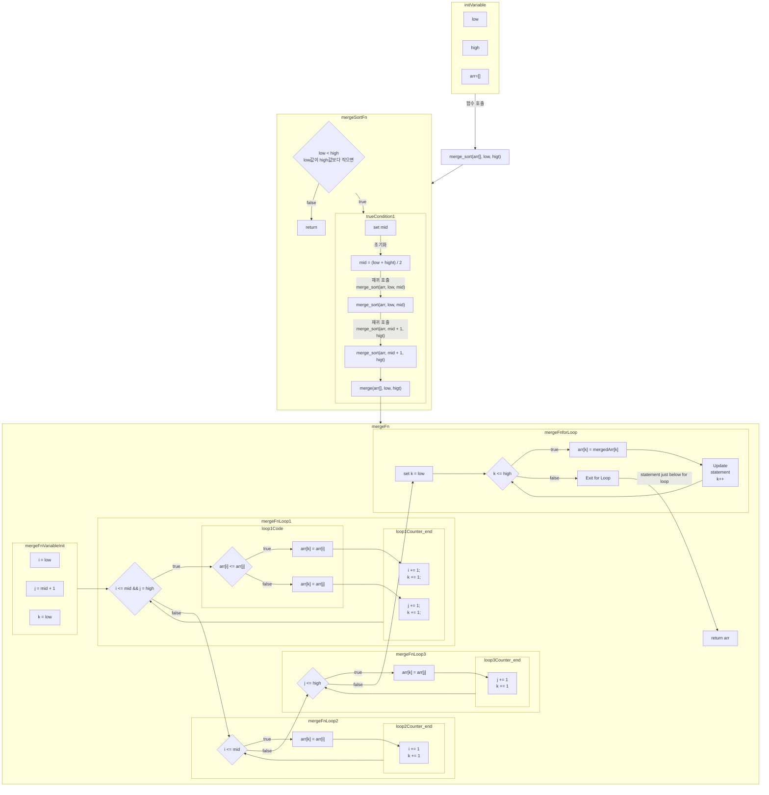

```mermaid
flowchart TB
    mergeFn["function merge(arr, low, mid, high)"]

    subgraph initVariable
        low
        high
        arr["arr=[]"]
    end

    subgraph mergeSortFn
        direction LR
        subgraph trueCondition1
            direction LR
            set_mid["set mid"] --"초기화"--> init["mid = (low + hight) / 2"]
            recursive1["merge_sort(arr, low, mid)"]
            init --"재귀 호출<br/>merge_sort(arr, low, mid)"--> recursive1
            recursive2["merge_sort(arr, mid + 1, higt)"]
            recursive1 --"재귀 호출<br/>merge_sort(arr, mid + 1, higt)"--> recursive2
            merge["merge(arr, low, mid, high)"]
            recursive2 --> merge
        end

        merge_sort_condition{low < high<br/>low값이 high값보다 작으면}
        merge_sort_condition -- "false" --> return
        merge_sort_condition -- "true" --> trueCondition1
    end
    
    subgraph mergeFn
        direction LR
        result["return arr"]
        
        subgraph mergeFnVariableInit
            direction LR
            set_i["i = low"]
            set_j["j = mid + 1"]
            set_k["k = low"]
        end

        subgraph mergeFnLoop1
            direction TB
            while1{"i <= mid && j = high"}
            mergeFnLoop1Condition{"arr[i] <= arr[j]"}
            arr_k_i["arr[k] = arr[i]"]
            arr_k_j["arr[k] = arr[j]"]
            true_cnt["i += 1;<br/>k += 1;"]
            false_cnt["j += 1;<br/>k += 1;"]

            while1--true-->mergeFnLoop1Condition
            subgraph "loop1Code"
                direction TB
                mergeFnLoop1Condition--true-->arr_k_i
                mergeFnLoop1Condition--false-->arr_k_j
            end
            subgraph "loop1Counter_end"
                arr_k_i-->true_cnt
                arr_k_j-->false_cnt
            end
            loop1Counter_end-->while1
        end

        subgraph mergeFnLoop2
            direction LR
            while2{"i <= mid"}
            arr_k2["arr[k] = arr[i]"]
            cnt_2["i += 1<br/>k += 1"]

            subgraph "loop2Counter_end"
                cnt_2
            end

            while2--true-->arr_k2
            arr_k2-->cnt_2
            loop2Counter_end-->while2
        end

        subgraph mergeFnLoop3
            direction LR
            while3{"j <= high"}
            arr_k3["arr[k] = arr[j]"]
            cnt_3["j += 1<br/>k += 1"]
            
            subgraph "loop3Counter_end"
                cnt_3
            end

            while3--true-->arr_k3
            arr_k3-->cnt_3
            loop3Counter_end-->while3
        end

        subgraph mergeFnforLoop
            for_set_k["set k = low"]
            for_condition{"k <= high"}
            body_of_for_loop["arr[k] = mergedArr[k]"]
            update_loop["Update<br/>statement<br/>k++"]
            exit_loop["Exit for Loop"]

            for_set_k-->for_condition
            for_condition--true-->body_of_for_loop-->update_loop-->for_condition
            for_condition--false-->exit_loop
        end

        mergeFnVariableInit --> while1
        while1 --false--> while2
        while2 --false--> while3
        while3 --false--> for_set_k
        exit_loop--"statement just below for loop"-->result
    end
    
    sort["merge_sort(arr[], low, higt)"]
    merge["merge(arr[], low, higt)"]
    initVariable --"함수 호출"--> sort
    sort --> mergeSortFn
    merge --> mergeFn
```