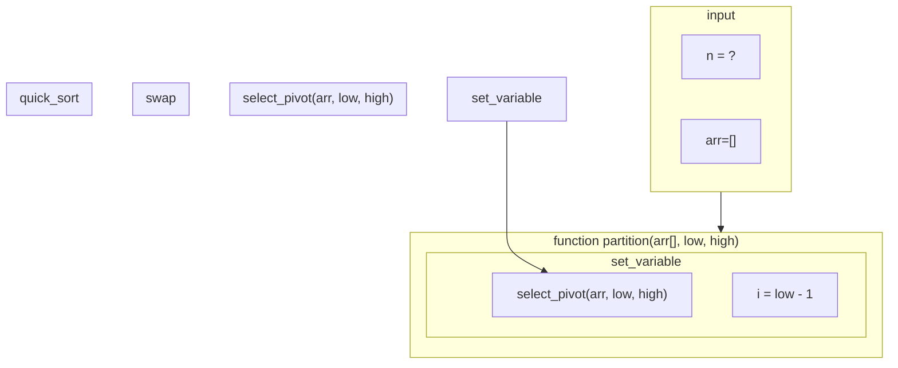

```mermaid
flowchart TD
    subgraph input
        n["n = ?"]
        array["arr=[]"]
    end
    subgraph partition["function partition(arr[], low, high)"]
        subgraph set_variable 
            set_pivot["select_pivot(arr, low, high)"]
            set_i["i = low - 1"]
        end
    end
    subgraph select_pivot["select_pivot(arr, low, high)"]
    end
    subgraph swap
    end
    subgraph quick_sort
    end
    
    input --> partition
    set_variable --> set_pivot
```